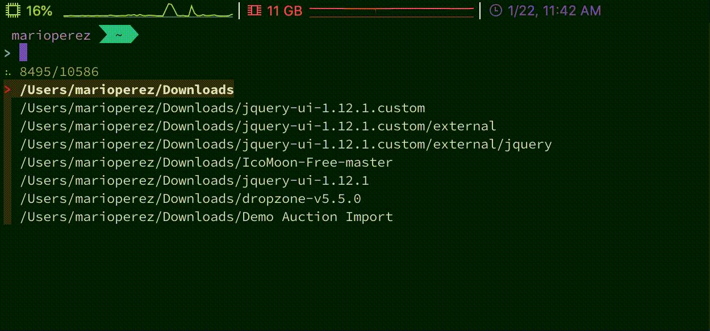

# Dotfiles - thismarioperez



## Installation
1. Install [Homebrew](https://https://brew.sh/).
2. Clone this repository into `~/Repositories`.
3. Depending on what environment you'll be on (work or personal), run one of the following commands from your terminal:

For Personal MacOs Use:
```
mkdir ~/Repositories && cd ~/Repositories && git clone https://github.com/thismarioperez/Dotfiles.git && cd Dotfiles && chmod 755 ./install.sh && ./install.sh
```

For Personal Linux Use:
```
mkdir ~/Repositories && cd ~/Repositories && git clone -b linux https://github.com/thismarioperez/Dotfiles.git && cd Dotfiles && chmod 755 ./install.sh && ./install.sh
```

For Work MacOs Use:
```
mkdir ~/Repositories && cd ~/Repositories && git clone -b work https://github.com/thismarioperez/Dotfiles.git && cd Dotfiles && chmod 755 ./install.sh && ./install.sh
```

## Misc
### Night Owl - My preferred theme for everything
[Night Owl for vscode](https://github.com/sdras/night-owl-vscode-theme)

[Night Owl for iterm2](https://github.com/nickcernis/iterm2-night-owl)

[Night Owl for windows terminal](https://github.com/edurojasr/Windows-Terminal-Theme-Night-Owl)

[Night Owl for slack](https://github.com/thismarioperez/night-owl-slack) - My personal port of Night Owl for slack

[thismarioperez - zsh-theme](https://github.com/thismarioperez/thismarioperez-zsh-theme) - My personal Night Owl inspired zsh theme
